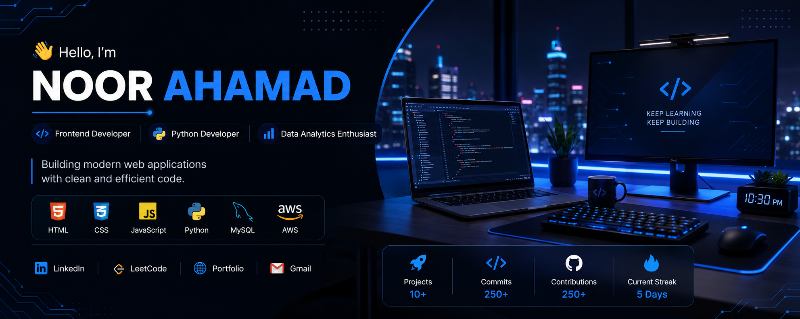
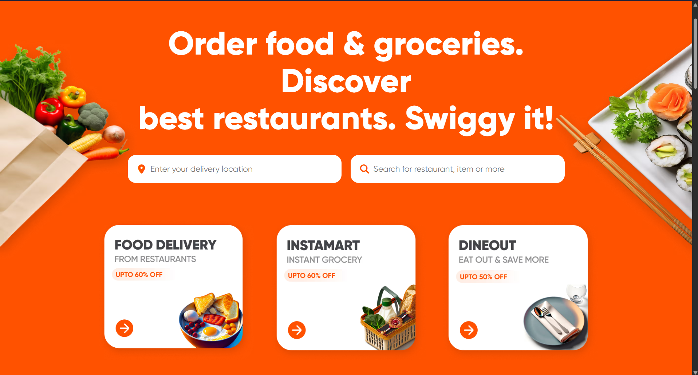
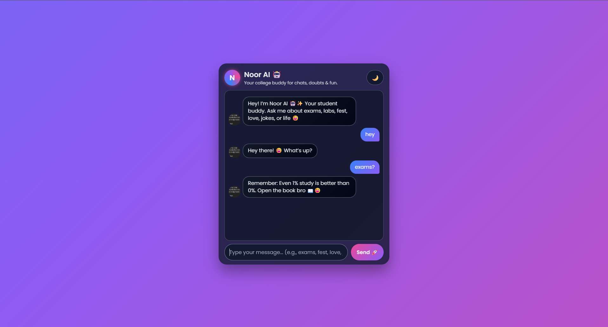
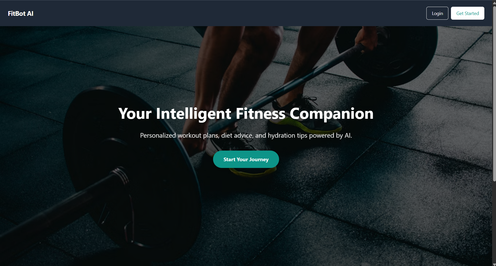

<p align="center">
  
</p>

<h1 align="center">Hi 👋, I'm Noor Ahamad</h1>

<h3 align="center">
Frontend Developer • Python Developer • Data Analytics Enthusiast
</h3>

<p align="center">

</p>

<p align="center">


</p>

---

# 🚀 About Me

🎓 Final Year Computer Science Engineering Student

💻 Passionate Frontend Developer with a strong foundation in Python and MySQL.

📊 Interested in Data Analytics, Data Science, and building responsive web applications.

☁️ Currently learning AWS while improving my development and problem-solving skills.

🎯 Open to Software Developer and Frontend Developer opportunities.

---

# 🌐 Connect With Me

<p align="center">

<a href="https://www.linkedin.com/in/k-s-noor-ahmed-943403319">

</a>

<a href="https://leetcode.com/u/noorahmedks_/">

</a>

<a href="https://Noorahmedks-2103.github.io/">

</a>

<a href="mailto:nkurnipalli34@gmail.com">

</a>

</p>

---

# 💻 Tech Stack

### 🌐 Frontend

<p>

</p>

### 🐍 Programming

<p>

</p>

### 🗄️ Database

<p>

</p>

### 📊 Data & Analytics

<p>


</p>

### 🛠️ Tools

<p>

</p>

### ☁️ Cloud

<p>

</p>

---

# 🚀 Featured Projects

<table>

<tr>

<td width="50%" valign="top">

<h3 align="center">🍔 Swiggy Clone</h3>



Responsive Swiggy-inspired food ordering interface.

<p align="center">

<a href="https://github.com/Noorahmedks-2103/Swiggy_clone">

</a>

<a href="YOUR_LIVE_DEMO_HERE">

</a>

</p>

</td>

<td width="50%" valign="top">

<h3 align="center">🤖 NoorAI Chatbot</h3>



AI-powered chatbot website.

<p align="center">

<a href="https://github.com/Noorahmedks-2103/NoorAI-Chatbot-Website">

</a>

</p>

</td>

</tr>

<tr>

<td width="50%" valign="top">

<h3 align="center">💪 FitBot</h3>



Fitness tracking web application.

<p align="center">

<a href="https://github.com/Noorahmedks-2103/Fitbot_project">

</a>

</p>

</td>

<td width="50%" valign="top">

<h3 align="center">🌐 Portfolio Website</h3>


Personal portfolio website.

<p align="center">

<a href="https://github.com/Noorahmedks-2103/Noorahmedks-2103.github.io">

</a>

<a href="https://Noorahmedks-2103.github.io/">

</a>

</p>

</td>

</tr>

</table>

---

# 📊 GitHub Dashboard

<p align="center">


</p>

<p align="center">


</p>

---

# 📈 Contribution Graph

<p align="center">


</p>

---

# 🏆 GitHub Trophies

<p align="center">


</p>

---

# 🐍 Contribution Snake

> Uncomment after your GitHub Action is working.

```md
<!--
<p align="center">


</p>
-->
```

---

# 💬 Favorite Quote

> **"Consistency beats intensity. Keep building, keep learning."**

---

<div align="center">

## 🤝 Let's Connect

Building modern web applications one project at a time.

⭐ If you like my work, consider starring my repositories.

Thanks for visiting! 🚀

</div>